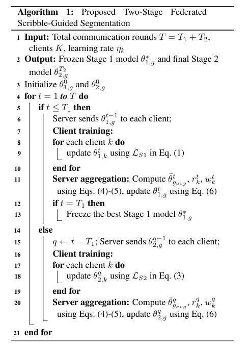

# FEDSRA: FEDERATED SCRIBBLE-GUIDED SEGMENTATION WITH RESIDUAL DIFFUSION REFINEMENT AND ADAPTIVE AGGREGATION
This is the official Pytorch implementation of our ICASSP, 2027 submitted paper "FEDSRA: FEDERATED SCRIBBLE-GUIDED SEGMENTATION WITH RESIDUAL DIFFUSION REFINEMENT AND ADAPTIVE AGGREGATION".

> Abstract: Federated medical image segmentation enables collaborative learning across institutions without sharing local data, but heterogeneous client distributions can degrade segmentation performance. We propose a novel lightweight two-stage federated framework for supervised scribble-guided medical image segmentation. In the first stage, each client trains a scribble-conditioned segmentation network using local dense masks and foreground-background scribbles. In the second stage, selected Stage 1 model is frozen and learns only an error-focused correction using a residual diffusion refinement network, producing the final prediction in a single deterministic network evaluation without iterative reverse sampling. Both stages employ an angular consistency and magnitude-aware aggregation strategy to handle heterogeneous client updates. Experiments on breast tumor and polyp lesion segmentation datasets show significant improvements in Dice, IoU, and HD95, and converge faster in fewer communication rounds over established and recent federated baselines.
> 

> 
## Dependencies
- Python 3.10
- PyTorch 2.5.1
- NVIDIA GPU + [CUDA](https://developer.nvidia.com/cuda-downloads)

## Create environment and install packages
- `conda create -n FEDSRA python=3.10`
- `conda activate FEDSRA`
- `pip install -r requirements.txt`

## Testing
Download the test dataset from [GoogleDrive](https://drive.google.com/file/d/1YNtNhTi8rZ2LfgCyANDeIOfuSpJJ4ILm/view?usp=sharing) and place them in the project directory.

The folder structure within `datasets` should be organized as follows.
```
datasets/
├── B1/
│   ├── test/
│   │   ├── image/
│   │   └── mask/
├── B2/
├── B3/
├── B4/

```


